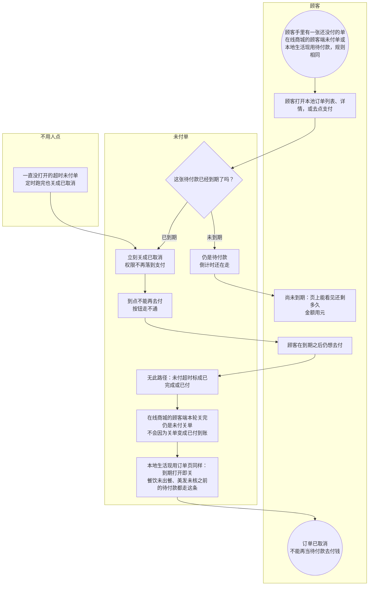

# 未付超时关单-泳道

这张图看未付单到期之后怎么关。顾客打开列表、详情或去支付时，到期立刻变成已取消，到点不能再付。后台定时仍会关。在线商城的顾客端和本地生活现用订单页同一套关单规则，本图加注，不另画一张店内关单图。

## 给谁看

开会、测试倒计时和到期不能付。细则在《订单支付与结算》《众享源品怎么逛买》；本地现用订单见分端《众享营销-本地生活》。

## 关键规则

- 待付款页要能看见还剩多久。到期打开即关成已取消。
- 一直没打开的超时单，定时跑完也是已取消。
- 未付取消或超时不得标成已完成。倒计时具体分钟数图上不写死。
- 在线商城的顾客端本轮关完仍是未付关单，不会变成已付。

## 图

## 不画什么

- 不把已付退款、发货、核销画进本图。
- 无此路径：超时标成已完成、到期仍能付、在线商城的顾客端因关单变成已付。
- 不写死倒计时分钟数。部分退、退货物流无此路径。
- 不画端口和域名。
