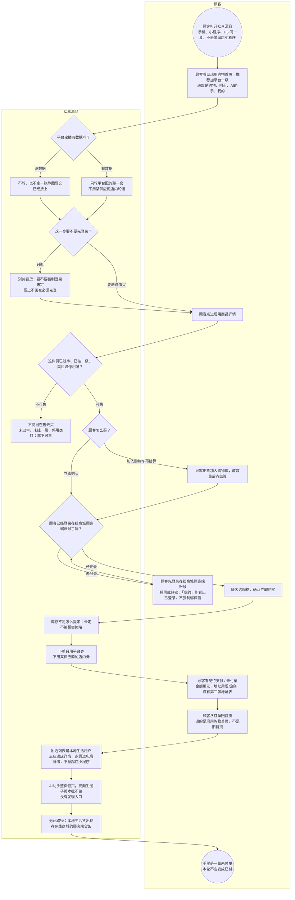

# 浏览到下未付单-泳道

这张图看在线商城顾客怎么从现用首页逛到已审商品，立即购买或购物车结算走出未付单。本轮不真扣款。不要把店内小程序逛买画进来。

## 给谁看

开会投在线商城的顾客端主链；测试未过审不能买、加购能进购物车、下单须登录。细则在《众享源品怎么逛买》；页面在分端《众享源品-在线商城》。钱和未付见《订单支付与结算》。

## 关键规则

- 轮播只渲染平台配的那一套；没数据就不轮，不用静图冒充已经接上。
- 立即购买可选规格，走出未付单。加入购物车写入购物车，可改数量再结算。
- 下单须登录。浏览要不要强制登录：**未定**。未过审、未挂一级、类目停用：不可售。
- 回首页进现用购物首页，不把旧首页画成在线商城的顾客端主页。金额用元。用平台券，不用某供应商店内券。
- 底部四栏：购物 / 附近 / AI助手 / 我的。没有发现。AI 整页假页。审过的商城秒杀、拼团也能走出未付单。

## 图

## 不画什么

- 不画店内扫桌、核销、商城发货细链。
- 无此路径：未过审可买、真扣款成功、店内货出现在在线商城的顾客端、发现对接、拉起店小程序。
- 浏览是否强制登录、库存不足提示保持未定。
- 倒计时关单见同夹另一张。点支付后本轮不调起通道见《众享源品支付》。源品活动开场见《拼团秒杀》。
- 不画端口和域名。
