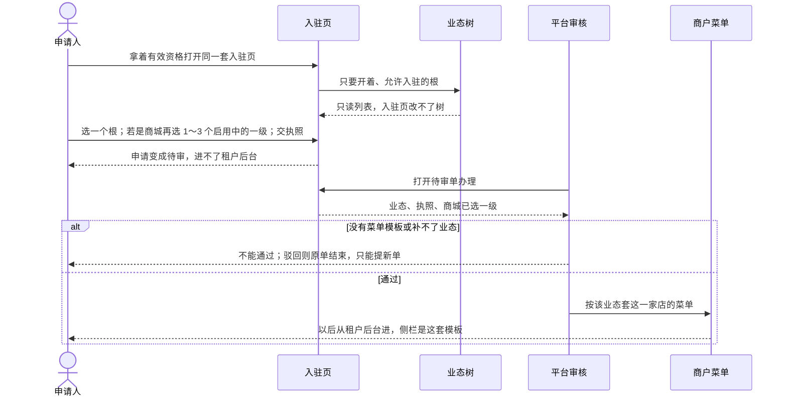

# 入驻与审核-时序

这张图看入驻页、审核、套菜单谁先谁后。入驻只读业态树，不在入驻页改树。通过后才套该业态菜单。不写接口路径、字段名。

## 给谁看

开发交接套菜单时机。细则在《租户入驻与审核》；泳道见同夹《入驻与审核-泳道》。

## 关键规则

- 入驻页只读「入驻可选」开着的根。在线商城再读启用中的一级。
- 没有菜单模板不能通过。驳回只能提新单。
- 不问自营。

## 图

## 不画什么

- 不写字段名、接口路径、端口、域名。
- 无此路径：入驻页改树、自营勾选、改原单再送。
- 发品、履约不在本图。
