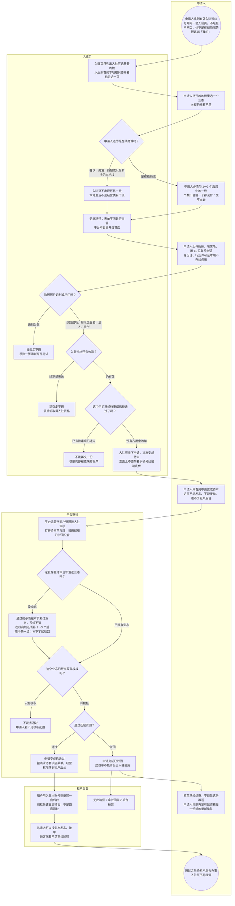

# 入驻与审核-泳道

这张图看申请人怎么从入驻页交到待审、平台怎么通过或驳回、通过之后权限落到哪套租户菜单。全业态同一套入驻页，没有第二套入驻产品。驳回不能改原单再送。

## 给谁看

开会投主链；测试按菱形走驳回、过期、同手机再提。细则在功能需求《租户入驻与审核》；页面在分端《租户入驻》《平台后台》入驻审核节。套哪套菜单见《租户后台与菜单》。

## 关键规则

- 选项只出现「入驻可选」开着的根；本地生活不选一级；在线商城必须选 1～3 个启用中的一级。
- 执照沿用现页，识别成功才能交。不问是否自营。
- 待审或已通过的同一手机不能再提；驳回只能提新单。没有菜单模板的业态不能通过。
- 存量待审当年没选业态：通过前补选，系统不猜。

## 图

## 不画什么

- 不按餐饮 / 美发 / 商超画三套入驻产品；不把「到店」画成一种可选项。
- 无此路径：自营勾选、身份证/行业许可证必填、改原单再送、平台自己开自营店。
- 不画推广获客细链、店员出餐、抽佣死数字、端口和域名。
- 入驻套菜单的调用先后见同夹时序（本批不画）。
