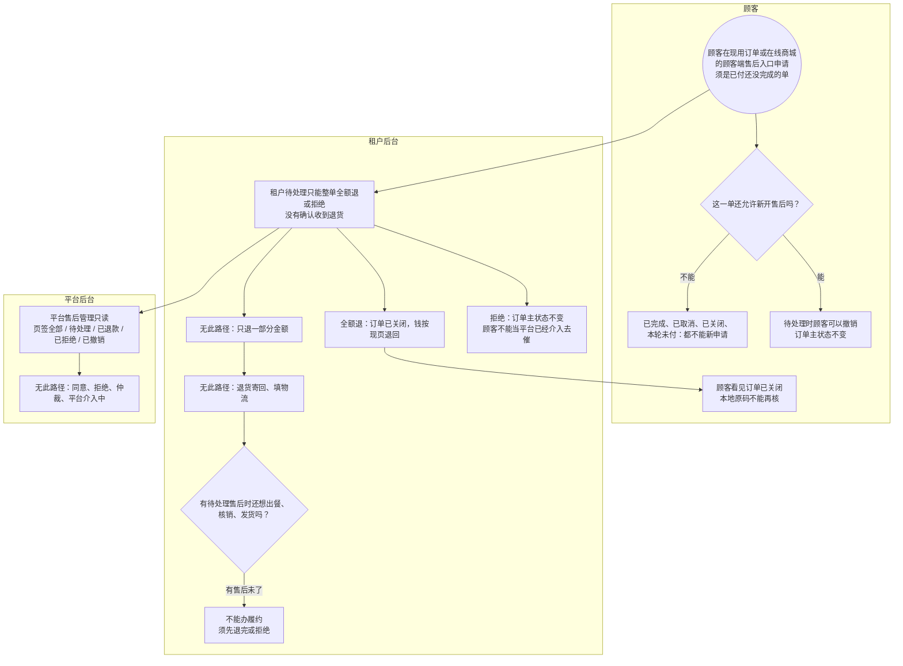

# 整单退款-泳道

这张图看已付还没完成的整单怎么退。租户全额退或拒绝。平台只看不办。部分退、退货物流本期无此路径。在线商城的顾客端本轮未付本来就不能申请售后。

## 给谁看

开会投售后边界；测试平台列表不能点办理。细则在《售后与退款》。

## 关键规则

- 仅已付待履约（美发/商超显示待核销）或在线商城的顾客端履约中可新申请。已完成、已取消、已关闭不能新申请。
- 待处理时可撤销。有待处理售后时不能出餐、核销、发货、确认收货。
- 全额退完：订单已关闭；本地该单码不能再核，不补第二张主码。
- 给人看用元。

## 图

## 不画什么

- 无此路径：部分退、退货物流、平台仲裁、超管代退办理口。
- 不新编退款通道状态机。不画端口、域名。
