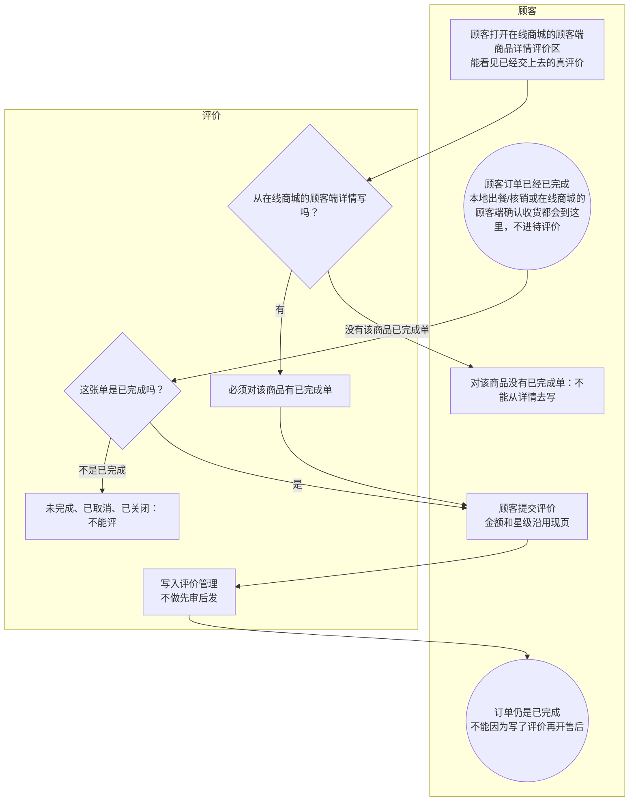

# 真评价-泳道

这张图看谁能写评价、写完订单变成什么。只有已完成订单能写。本地出餐或核销完成不进待评价，直接已完成，仍可评。在线商城的顾客端详情展示真评价，不是假数据。

## 给谁看

开会讲没有待评价主状态。细则在《众享源品怎么逛买》《本地生活怎么履约》；售后见《售后与退款》。

## 关键规则

- 已完成可评，评完仍是已完成。已取消、已关闭不能评。
- 在线商城的顾客端详情：有该商品已完成单的人才能从详情去写；谁都能看见已提交的真评价。
- 不做先审后发。

## 图

## 不画什么

- 无此路径：待评价主状态、假评价、先审后发。
- 不把本地完成画成必须先评才能完成。
- 不画端口、域名。
