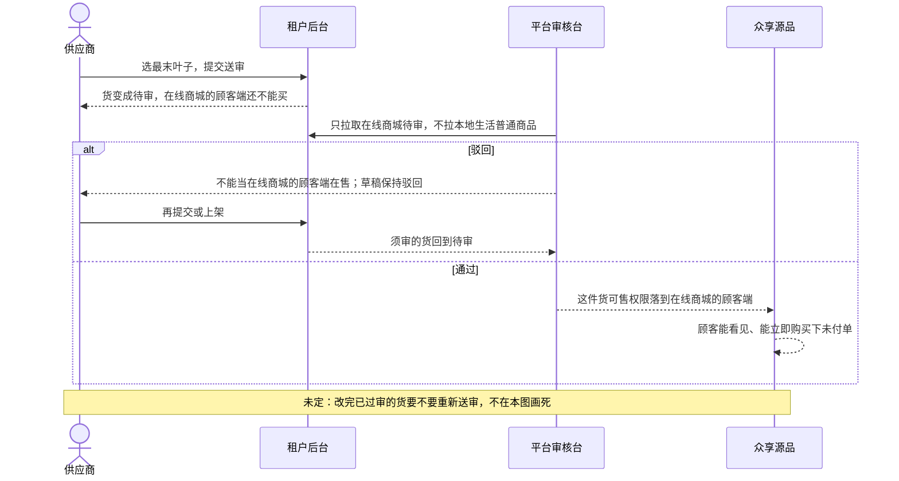

# 商城审品-时序

这张图看供应商送审之后，谁让货出现在在线商城的顾客端。只办理在线商城。本地生活普通商品不进这队列。不写接口路径、字段名。

## 给谁看

开发交接审核台。细则在《商品类目与审核》；泳道见同夹《在线商城发品与审核-泳道》。

## 关键规则

- 挂叶子才能送审。未过审不能买。
- 批量逐条独立，失败列出原因。
- 编辑后是否重审：未定，本图不画成已定。

## 图

## 不画什么

- 不画本地上架即可售。不写接口路径、字段名、端口、域名。
- 无此路径：本地货进审核台、拼团秒杀进审核台、未过审出现在在线商城的顾客端。
