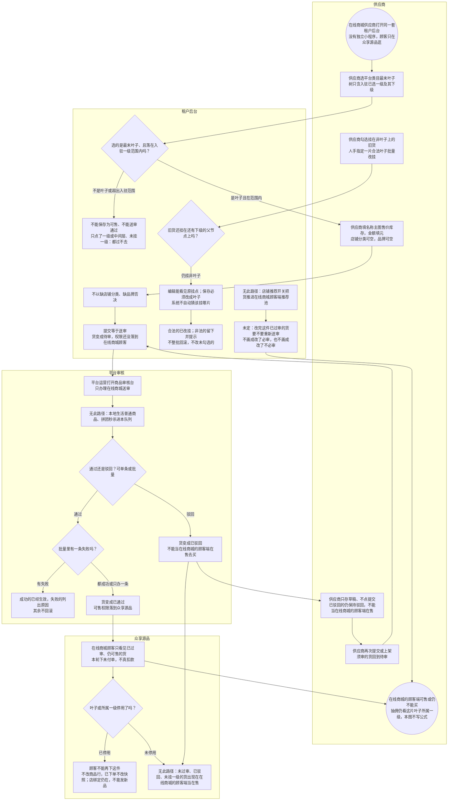

# 在线商城发品与审核-泳道

这张图看供应商怎么挂平台类目叶子、送平台审核、通过后众享源品才能卖。未过审不能买。不要和本地「上架即可售」画成一张图。

## 给谁看

开会讲在线商城的顾客端货必须盖章；测试挂非叶子、驳回、批量失败。细则在《商品类目与审核》；页面在分端《租户后台（在线商城）》《平台后台》商品审核节。抽佣取叶子所属一级，见《业态经营类目与抽佣》。

## 关键规则

- 树只含本店入驻已选一级及其下级；只能选最末叶子。未挂一级不可售。
- 店铺分类可以空；品牌可以空。店铺推荐开关不把货推进在线商城顾客端推荐池。
- 草稿保持驳回；再提交或上架回到待审。批量通过/驳回逐条独立。
- 编辑后是否要重新送审：**未定**，不画成已定。

## 图

## 不画什么

- 不把本地上架即可售画进本图。
- 无此路径：未过审就出现在在线商城的顾客端、店铺分类必选、缺品牌否决、店铺推荐当在线商城的顾客端推荐、本地货进审核台。
- 编辑后是否重审保持未定，不编造。
- 不画发货、真扣款成功、抽佣死数字、端口和域名。
- 商城审品调用先后见同夹时序（本批不画）。
