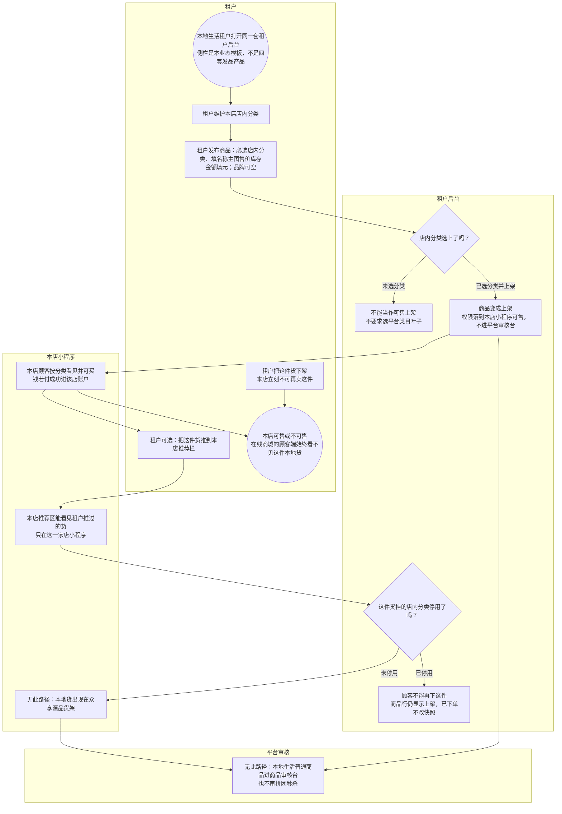

# 本地生活发品-泳道

这张图看餐饮 / 美发 / 商超怎么在本店上架就能卖。平台审核台没有这一单。本地货不进众享源品。不要和商城送审画成一张「发布 + 审核」。

## 给谁看

开会讲「店内上架即可售」；测试分类必选和停用后不能再买。细则在《商品类目与审核》；页面在分端《租户后台（本地生活）》。

## 关键规则

- 发品必选店内分类。上架后本店小程序可售，没有平台待审态。
- 可把货推到本店推荐栏，只作用于本店小程序，不是在线商城的顾客端推荐。
- 分类停用：已上架不可再售，不改商品行，已下单不改快照。
- 品牌可以选、不强制。金额给人看用元。

## 图

## 不画什么

- 不把审核台和店内上架合成一张通用发品图。
- 无此路径：本地货进在线商城的顾客端、店内推荐当在线商城的顾客端推荐、平台给本地普通商品盖章、把店内分类必选套到供应商。
- 不画抽佣公式、品牌馆、装修细图、端口和域名。
- 商城挂叶子送审见同夹另一张泳道。
