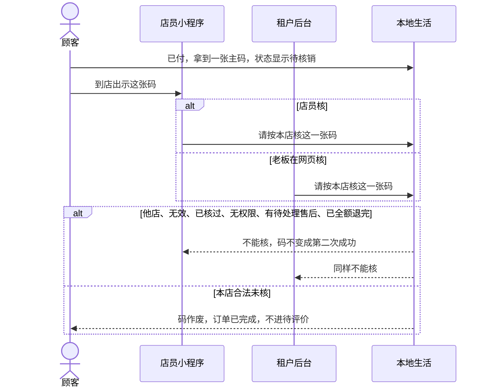

# 核销-时序

这张图看核销码怎么作废。店员小程序或租户后台都能核，结果是同一套。全额退后码不可再核。不写接口路径、字段名。

## 给谁看

开发交接两入口。细则在《本地生活怎么履约》；泳道见同夹《美发商超核销-泳道》。

## 关键规则

- 整单一次。他店码、已核过、无权限都失败。
- 有待处理售后不能核。餐饮不走这张主路径。

## 图

## 不画什么

- 不写接口路径、字段名、端口、域名。
- 无此路径：部分核、按天作废、补第二张主码、只画网页不画店员。
- 扫桌出餐不在本图。
