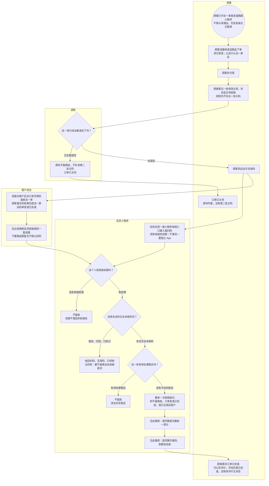

# 美发商超核销-泳道

这张图看拷贝源为美发或商超的店：顾客先付、出一张主码、到店整单一次核销，订单已完成。店员小程序和租户后台都能核，不要画成只有网页。餐饮不走这张图。

## 给谁看

开会投到店核销主链；测试他店码、全额退后不能再核、有售后不能核。细则在《本地生活怎么履约》；页面在分端《众享营销-本地生活》《租户后台（本地生活）》订单节。

## 关键规则

- 种子美发 / 商超及从这两套拷来的新根走核销。顾客已付待履约显示「待核销」。
- 整单一次核销，不能按件数核一部分。本期不设核销天数，也没有到期自动退。
- 拼团不另出一张主码。全额退完：原码不能再核，不补第二张主码。
- 非核销员不能核。他店的码不能核。有待处理售后时不能核。

## 图

## 不画什么

- 不画餐饮扫桌、在线商城的顾客端发货、核销调用先后时序（同夹时序本批不画）。
- 无此路径：部分核销、按天有效期、过期自动退、补第二张主码、待评价主状态、外卖、第四种履约。
- 不要把核销只画在租户网页上。
- 不画端口和域名。通知文案不验收死句子。
