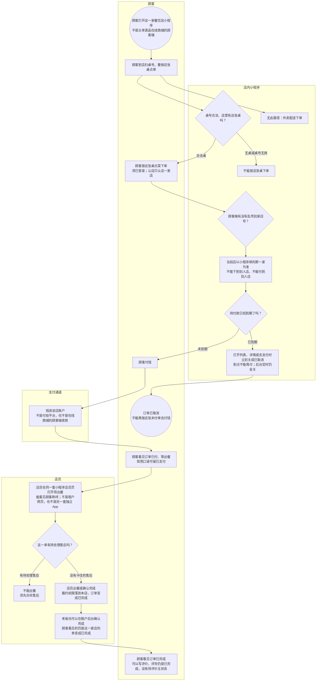

# 餐饮扫桌到出餐-泳道

这张图看拷贝源为餐饮的店：顾客扫合法桌、点单、付钱进该店、店员出餐后订单已完成。不进待评价。没有外卖。美发 / 商超不走这张图。

## 给谁看

开会投到店堂食主链；测试无效桌、未付关单、有售后不能出餐。细则在《本地生活怎么履约》；页面在分端《众享营销-本地生活》。钱进该店见《订单支付与结算》。

## 关键规则

- 履约跟拷贝源：种子餐饮及从餐饮拷来的新根走扫桌。到店是履约，不是一种业态。
- 认店：下单、支付不能信顾客端随便传的店号。无桌、桌号无效：不能按这张桌下单。
- 出餐或确认完成 → 已完成，不进待评价。已完成可写评价，评完仍是已完成。
- 有待处理售后时不能出餐。未付到期打开即关成已取消，到点不能再付。

## 图

## 不画什么

- 不画美发 / 商超核销、在线商城的顾客端逛买、商城发货。
- 无此路径：外卖、第四种履约、待评价主状态、未付关成已完成。
- 重复扫同一桌的清台规则沿用现页，不编造。
- 预约只点到：默认仅餐饮且受首页模块归属，本图不把预约画成主链。
- 不画端口和域名。付到店细链、两种回调见以后支付夹。
