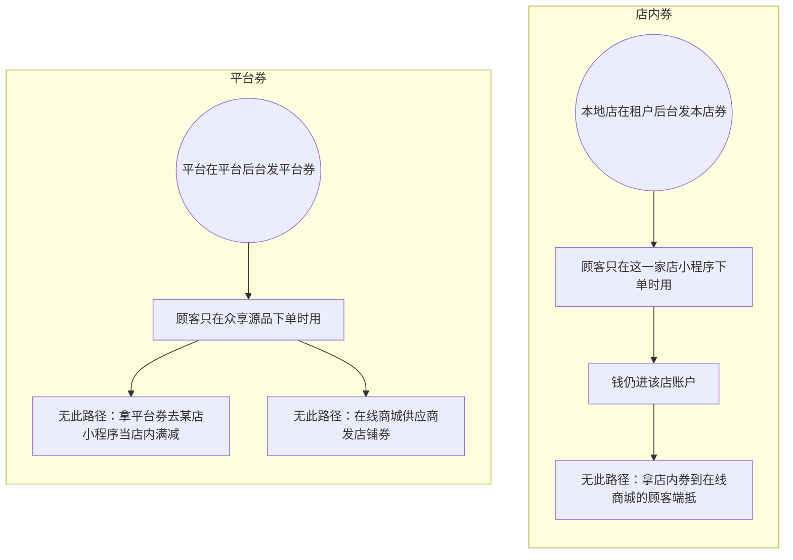

# 优惠券-泳道

这张图必须画成两条：店内券只在该店用，平台券只在在线商城的顾客端用。不要汇成一张全场通用券。供应商没有发店铺券的菜单。

## 给谁看

开会讲两类券不能互抵。细则在《优惠券》《钱和券怎么算》。

## 关键规则

- 门槛、叠加、过期未点名的沿用现页，不编满减数字。
- 本轮在线商城的顾客端可以下未付单、不真扣款，券规则仍按两类分开，不要写成没有券。

## 图

## 不画什么

- 无此路径：全场一张通用券、给供应商加发券菜单。
- 不编门槛数字。不画端口、域名。
