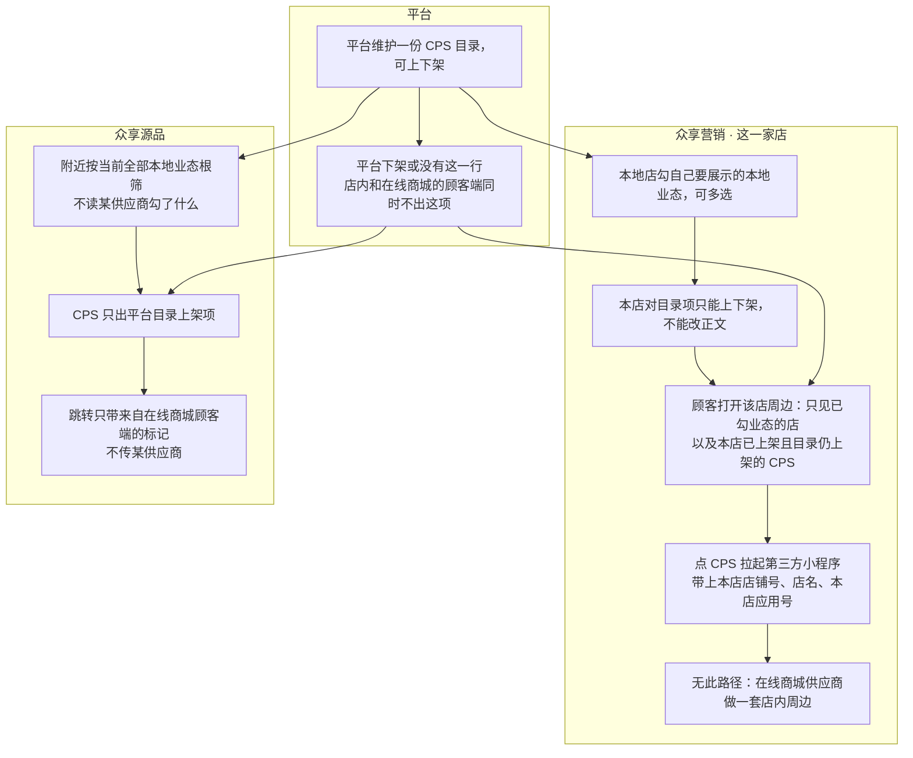

# 周边与CPS-泳道

这张图必须分叉：店内附近按**本店已勾本地业态**；在线商城的顾客端附近是**平台级全部本地根**，不带某供应商。供应商没有周边菜单。

## 给谁看

开会讲两边「附近」不是同一套规则。细则在《周边与到店服务》。

## 关键规则

- 平台一份 CPS 目录。无行或平台下架，店内和在线商城的顾客端都不出。
- 本地店只能上下架引用，不能改目录正文。
- 在线商城的顾客端底部附近页可以还在、默认不露，本图只定筛选规则。

## 图

## 不画什么

- 无此路径：把店内附近和在线商城的顾客端附近画成同一条、恢复周边分类管理、给供应商周边。
- 不编未点名的跳转键。不画端口、域名。
