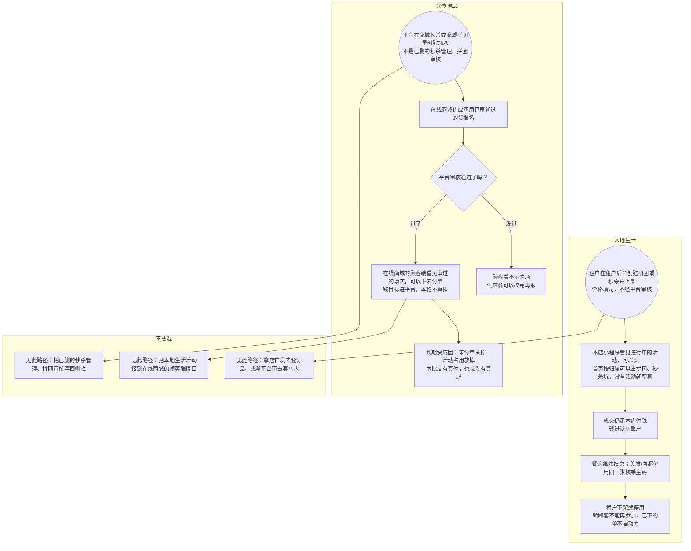

# 拼团秒杀-泳道

这张图看两条流程：本地生活店自己上架；众享源品平台开场、供应商报名、平台审。成交仍走同一套付钱。不要把已删的秒杀管理、拼团审核画回来。

## 给谁看

开会讲「店自发一套、源品平台审一套」。细则在《拼团与秒杀》。

## 关键规则

- 有该菜单的本地店都可以自发，不要写死三个业态名。
- 下架后新参失败，旧单不自动关、不自动退。
- 美发/商超拼团不另出主码。餐饮拼团仍扫桌。
- 源品只能报已审货。到期没成团关未付单。本批没有真退。

## 图

## 不画什么

- 无此路径：已删经营旧入口、另做一套支付、本批真退款。
- 活动玩法不改一版新规则。不画端口、域名。
