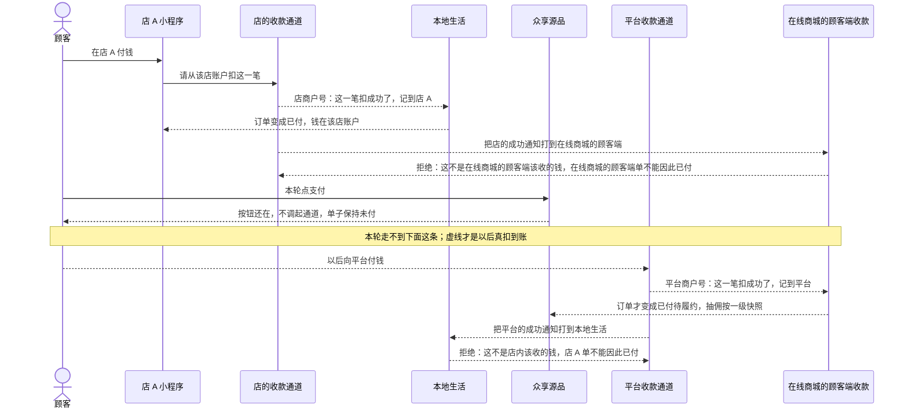

# 两种支付回调-时序

这张图看扣款成功之后通知打到哪一套。店商户号的成功通知只打本地生活；平台商户号的成功通知只打在线商城的顾客端。不能画成同一个回调口。本轮在线商城的顾客端不调起通道，走不到真回调。

## 给谁看

开发交接、测试串回调。细则在《订单支付与结算》；技术设计《支付结算与资金流向》。端口和域名只在《部署架构》，本图不写。

## 关键规则

- 本地生活付到该店：成功通知只认本地生活那一套，钱记到该店账户。
- 在线商城的顾客端目标付给平台：成功通知只认在线商城的顾客端那一套，不能打到店内或租户后台。
- 拿错套的通知必须拒绝，订单不能因此标成已付。
- 本轮在线商城的顾客端实线走不到回调；目标态用虚线。

## 图

## 不画什么

- 不把两套回调画成同一个口。不写接口路径、字段名、商户号、端口、域名。
- 无此路径：本轮在线商城的顾客端真扣成功、店回调让在线商城的顾客端已付、平台回调让店内已付。
- 不画退款回调细链、分账单字段。
