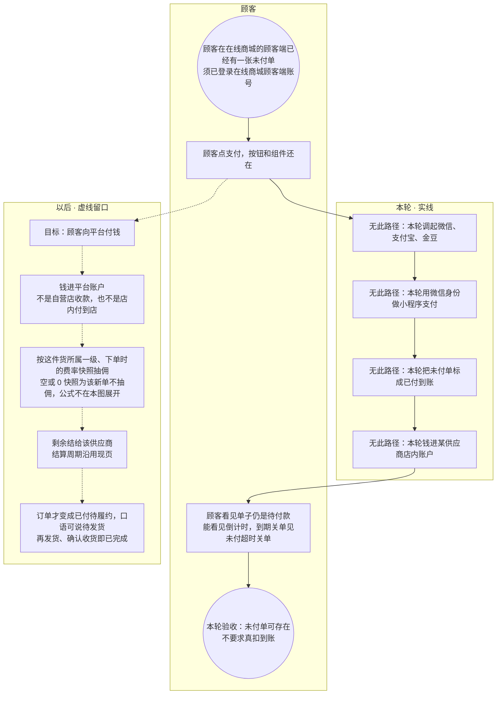

# 众享源品支付-泳道

这张图把本轮事实和目标态分开。本轮：顾客能下未付单、支付按钮还在，**不调起**微信 / 支付宝 / 金豆，单子保持未付。目标态用虚线：钱进平台账户，再按一级快照抽佣后结给供应商。不要画成本轮已经扣成功。

## 给谁看

开会讲在线商城的顾客端收款还没接到通道；测试点支付不能标成已付。细则在《订单支付与结算》《众享源品怎么逛买》；技术设计《支付结算与资金流向》。

## 关键规则

- 本轮点支付：按钮和组件还在，够去申请支付，不调起真通道。
- 本轮登录也不绑微信身份去付，不做微信小程序支付。
- 目标态收款方是平台账户，不是某供应商店内账户，也不是平台自营店。
- 拆单部分成功：**未定**。抽佣公式见《业态经营类目与抽佣》。未挂一级不能卖。

## 图

## 不画什么

- 不把虚线画成已经扣成功。不写通道商户号、端口、域名。
- 无此路径：本轮真扣款、微信小程序支付、钱进店内账户、未挂一级放行。
- 发货确认收货、两种回调时序、抽佣结算泳道以后画，本图只点到目标态。
- 拆单部分成功保持未定。部分退、退货物流无此路径。
