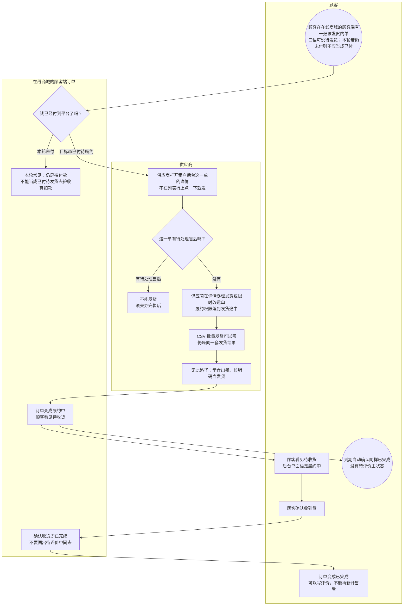

# 商城发货与确认收货-泳道

这张图看在线商城的顾客端货怎么发、怎么变成已完成。供应商在订单详情里发货，不在列表行上点一下就发。确认收货或到期自动确认即已完成，不经过待评价。堂食和核销不走这张图。

## 给谁看

开会投在线商城的顾客端履约；测试有售后不能发货、确认收货即完成。细则在《订单支付与结算》；页面在分端《租户后台（在线商城）》《众享源品-在线商城》。

## 关键规则

- 履约中只出现在在线商城的顾客端这条发货链。顾客端口语：待发货 / 待收货；后台书面语：已付待履约 / 履约中。
- 有待处理售后时不能发货、不能确认收货。
- 本轮 C 端常停未付，不应标成已付待发货；后台仍要能看、能在详情发货（闭口）。
- CSV 批量发货可以留；列表行内没有发货按钮。

## 图

## 不画什么

- 不画店内扫桌、核销、本地提现。
- 无此路径：列表行内发货、待评价中间态、部分退、退货物流、本轮把未付单验收成已付待发货。
- 不画端口、域名、快递公司接口字段。
