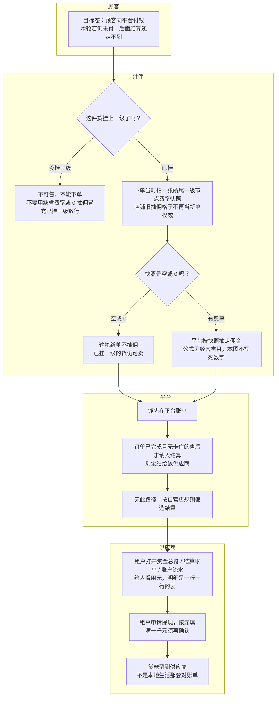

# 在线商城抽佣结算-泳道

这张图看在线商城的顾客端货的钱怎么分：目标态付给平台，按下单时一级类目快照抽佣，剩余结给供应商。空或 0 快照 = 该新单不抽佣。提现画在本图，不必再拆。本地生活不要画成也能提现。

## 给谁看

开会讲平台代收再结；测试未挂一级不能卖、空费率不是「没挂一级」。细则在《业态经营类目与抽佣》《订单支付与结算》《钱和券怎么算》。

## 关键规则

- 权威在树上的节点快照，不在店铺资料旧抽佣格子。事后改树不改旧单。
- 未挂一级：不可售、不能下单，不要当成按 0 放行。
- 结算从进入已完成起算。不以自营标记筛选。
- 提现按元填，满一千元须再确认。最低额未点名不编造。本轮 C 端未付则还没有可结的已付货款。

## 图

## 不画什么

- 不画本地线下对账、三套都提现。
- 无此路径：未挂一级按 0 放行、自营口径、本轮把未付单结成已付货款。
- 不写死费率、通道商户号、端口、域名。
