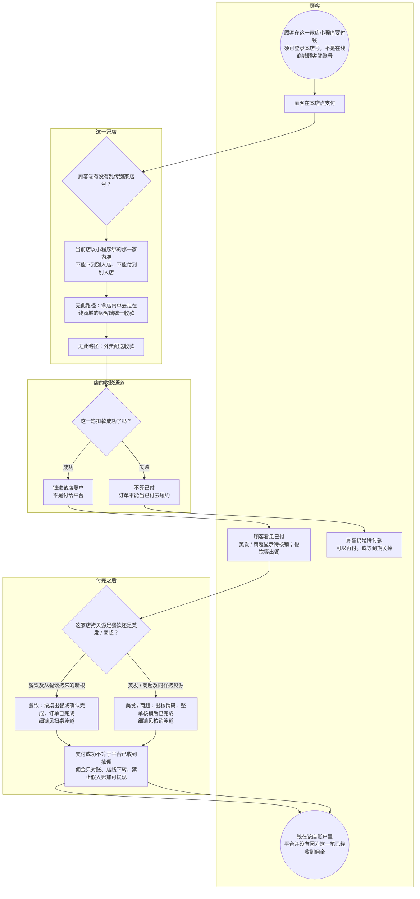

# 本地生活支付到店-泳道

这张图看店内成交的钱落到哪：顾客在这一家店付，钱进**该店账户**，不是付给平台。支付成功不等于平台已经收到抽佣。不要和在线商城的顾客端收款画成一张图。

## 给谁看

开会讲两条资金链；测试认店、付失败不算已付。细则在《订单支付与结算》；履约见《本地生活怎么履约》和已画的扫桌 / 核销泳道。

## 关键规则

- 认店：下单、支付不能信顾客端传来的店号，不能付到别人店。
- 付失败不算已付。未付到期关单见《未付超时关单》。
- 本地佣金只出对账单，禁止假入账去增加可提现余额。抽佣公式见《业态经营类目与抽佣》。
- 金额用元。通道商户号不编造、本图不写。

## 图

## 不画什么

- 不画在线商城的顾客端付给平台、两种回调时序、本地结算对账全文（结算泳道以后画）。
- 无此路径：付给平台、外卖、假入账增加可提现、店内票调在线商城的顾客端收款。
- 不写通道商户号、手续费死数字、端口和域名。
- 退款状态机沿用现页，本图不新编。
