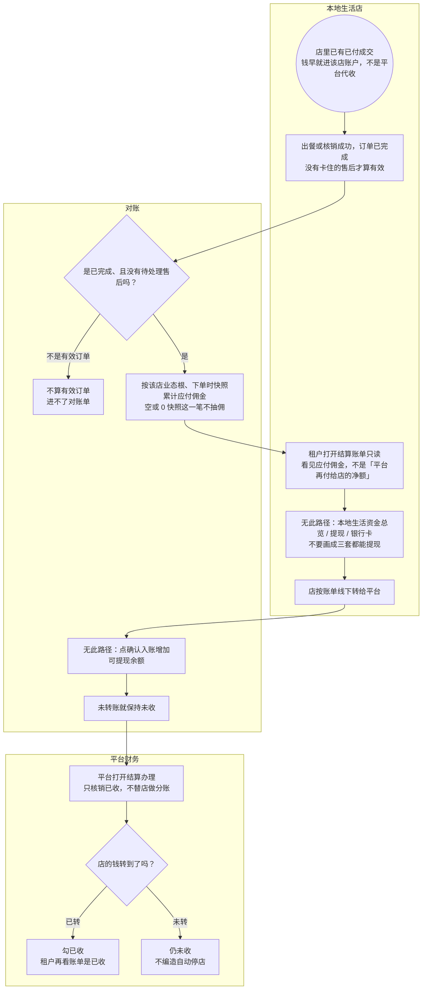

# 本地生活结算对账-泳道

这张图看本地生活抽佣怎么收回来：货款已经进店账户，平台只出对账单，店线下转，财务勾已收。禁止做成假入账去增加可提现余额。本地三套没有提现菜单。

## 给谁看

开会讲「店收了货款、平台怎么拿佣」；测试不能点入账加余额。细则在《订单支付与结算》《业态经营类目与抽佣》《钱和券怎么算》。

## 关键规则

- 对账单范围 = 已完成且没有卡住的售后。本地抽佣看业态根快照。
- 空或 0 快照：该新单不抽佣，仍可进有效订单，只是应付为 0。
- 不接微信分账、不接银行代扣。对公账号本期不入库。账期天数沿用现页，图上不写死。
- 费率死数字不画。

## 图

## 不画什么

- 不画商城抽佣结算、在线商城的顾客端提现。
- 无此路径：假入账、微信分账、银行代扣、本地提现菜单、自动停店。
- 不写死费率、账期天数、对公账号、端口、域名。
