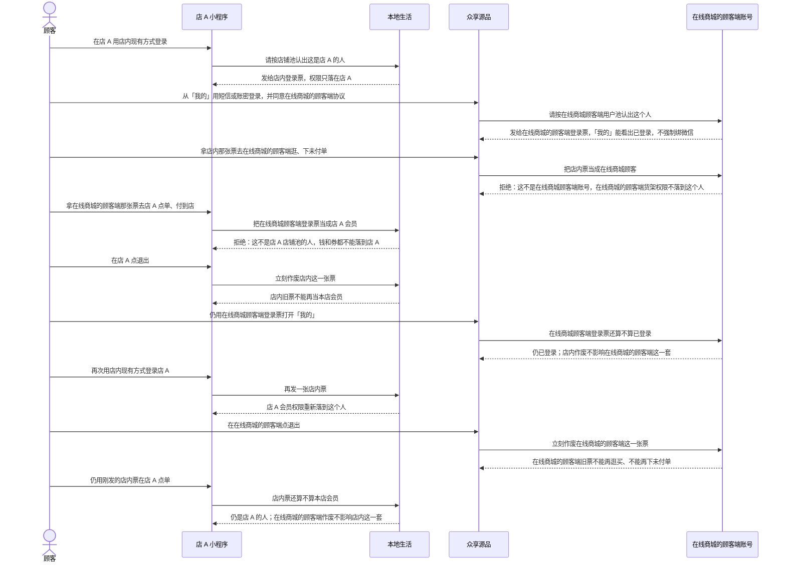

# 两套登录隔离-时序

这张图看两套登录态怎么错开：店内票不能调在线商城的顾客端，在线商城顾客端登录票不能调店内；作废其中一套，另一套还在。同一部手机可以同时是店 A 的号和在线商城顾客端的号，不是同一个会话。

## 给谁看

开发交接、测试串池。细则在《用户账号与用户池》《登录会话与口令》；两套怎么分别登录见同夹两张泳道。

## 关键规则

- 店铺池按「哪家店 + 手机」；在线商城顾客端用户池按「在线商城的顾客端 + 手机或账号」。读写必须带着在哪个池。
- 店内票调在线商城的顾客端必须拒绝；在线商城顾客端登录票调店内必须拒绝。
- 退出、改密、封号：只作废这一套。另一套原样可用。
- 不写接口路径、字段名、类名。闲置天数、票过期秒数图上不写死。

## 图

## 不画什么

- 不把两套登录合成一张「用户登录成功」图。
- 无此路径：第三方登录全家桶、短信二次验证、设备列表、异地登录提示、顾客端额外 30 分钟闲置。
- 不画支付回调、发品、履约、入驻资格票。
- 不画端口、域名、接口路径、字段名、类名。
