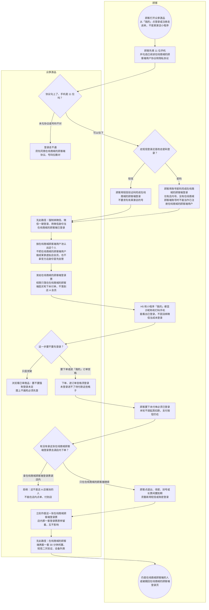

# 众享源品登录-泳道

这张图只看众享源品 - 在线商城：人在在线商城的顾客端单独注册、短信或账密登录，账号进在线商城顾客端用户池。「我的」必须能看出已登录。不要和店内登录画在一张图上。

## 给谁看

开会讲在线商城顾客端账号不是某家店会员；测试 H5「我的」不绑微信也能登。细则在《用户账号与用户池》《登录会话与口令》；页面在分端《众享源品-在线商城》。

## 关键规则

- 在线商城的顾客端独立池：按在线商城的顾客端加手机号或账号，不做成某家虚拟店会员。
- 从「我的」点登录走进来。先填 11 位手机，同意在线商城的顾客端《用户协议》《隐私协议》，再走短信或改走密码。
- 不强制绑微信，本轮不做微信一键登录。在线商城的顾客端登录态作废不影响店内票。
- 浏览要不要强制登录：未定。下单须登录。闲置天数、票过期秒数图上不写死。

## 图

## 不画什么

- 不画店内微信登录、认店、付到店。隔离先后见同夹《两套登录隔离-时序》。
- 无此路径：强制绑微信、微信一键登录、店内票当在线商城顾客端账号、真扣款成功、附近/AI/发现当登录主链。
- 无此路径：短信二次验证、设备列表、顾客端额外 30 分钟闲置。
- 不画端口和域名。浏览是否强制登录保持未定，不画成必须先登。
