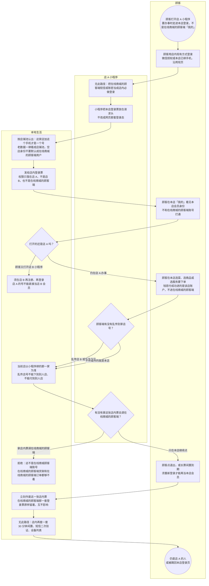

# 本地生活登录-泳道

这张图只看众享营销 - 本地生活：人在**某一家店**的小程序登录，账号进店铺池，权限只落在这一家店。不要和在线商城的顾客端登录画在一张图上。

## 给谁看

开会讲「店 A、店 B、在线商城的顾客端是三个号」；测试串店和下错池。细则在《用户账号与用户池》《登录会话与口令》；页面在分端《众享营销-本地生活》。

## 关键规则

- 店 A 注册只是店 A 的号；打开店 B 还要再注册。
- 认店只约束本端：购物车、下单、支付、券不能信顾客端传来的店号。
- 店内登录态放在请求头。店内票不能拿去调在线商城的顾客端。
- 本期不开在线商城的顾客端那套短信或账密作为店内必做登录。闲置天数、票过期秒数图上不写死。

## 图

## 不画什么

- 不画众享源品登录、在线商城的顾客端协议、在线商城的顾客端「我的」已登录。隔离先后见同夹《两套登录隔离-时序》。
- 无此路径：店内票调在线商城的顾客端、在线商城的顾客端账密铺到每家店、第三方登录全家桶、短信二次验证、设备列表、顾客端额外 30 分钟闲置。
- 不画后台网页登录、入驻资格票、端口和域名。
