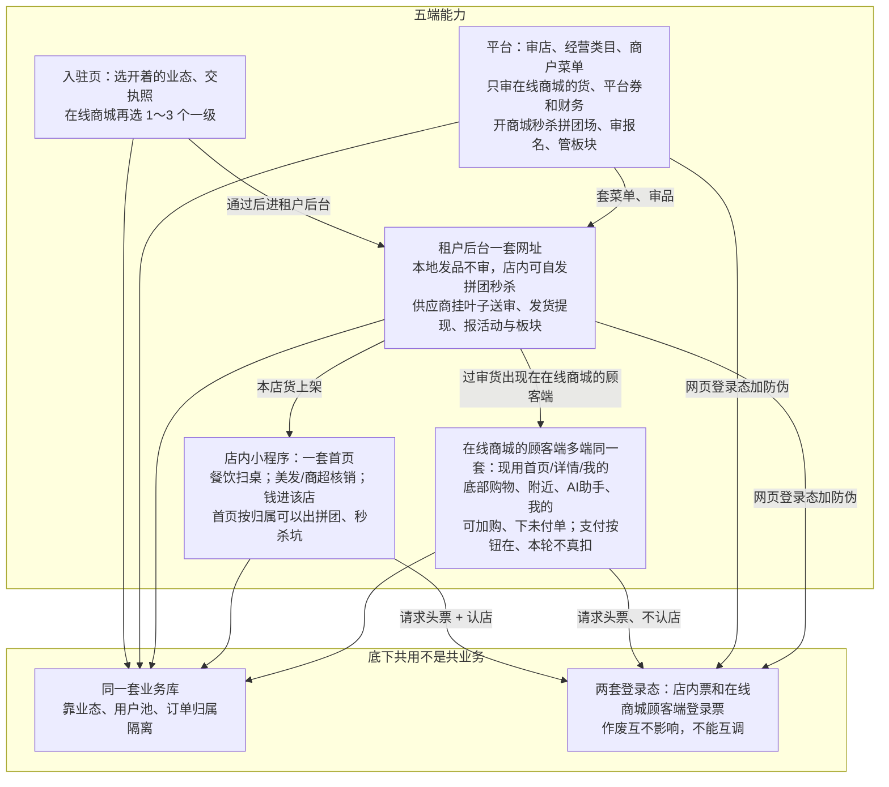

# 应用架构

这张图看五端各自能办什么，以及底下共用什么。平台和租户是后台暴露面；两套顾客端接口分开，登录态两套。不要按餐饮 / 美发 / 商超画成三套应用。

## 给谁看

开发、测试交接「接到哪一套」。对照《系统怎么拆》（含仓库目录）、《两套C端与独立打包》。

## 关键规则

- 在线商城的顾客端禁止接到本地生活接口或租户后台。
- 履约（扫桌 / 核销）只出现在本地生活。
- 两套二进制可以不同步发版：在线商城的顾客端挂了，店内和租户后台仍应能跑。
- 端口见《部署架构》。

## 图

## 不画什么

- 十个英文能力域名、类图、接口路径。
- 旧目录、装修细图、小魔推必验。
- 把「一个用户端」画成同时干店内和在线商城的顾客端。
