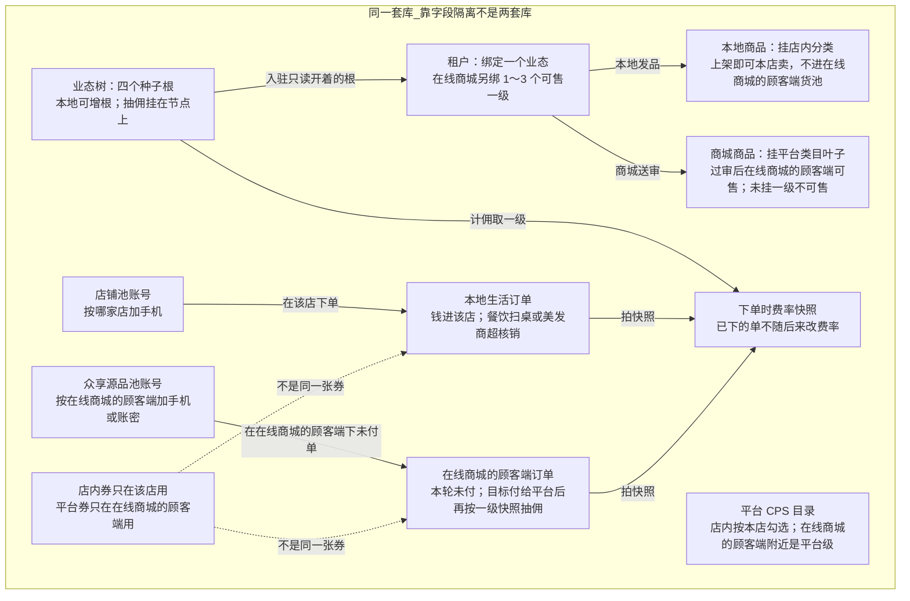

# 数据架构

这张图看逻辑上有哪些对象、怎么隔离。独立进程不等于两个库。给人看金额用元；新单抽佣看下单当时节点费率快照，店铺上旧抽佣格子不再当新单权威。公式在《业态经营类目与抽佣》。

## 给谁看

开会讲「会不会串号、串单」。对照《账号用户池与登录会话》《数据金额与快照》。

## 关键规则

- 两个用户池：店 A、店 B、在线商城的顾客端可以是三个号。
- 两类订单不要混成一个「商城订单」。
- 店内券和平台券不是一张券。
- 未挂一级的货不能作为可售、不能下单。
- 不画 Redis 几号库、逐表字段。

## 图

## 不画什么

- 全库 ER、表名清单、字段类型。
- 把共库画成两个数据库。
- 推广员改造、积分账户本期能力。
