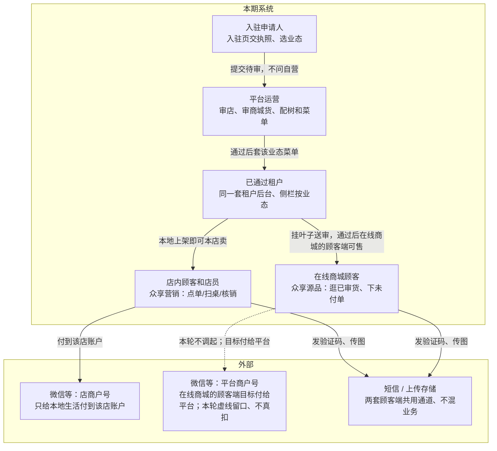

# 系统上下文

这张图看本期系统盒子和谁在外面。五端都是入口，不是五个互不相干的产品。钱有两条：店内付给该店，在线商城的顾客端目标付给平台（本轮在线商城的顾客端不真扣）。

## 给谁看

开会开场、对「谁用哪一端」。细则在总览《五端与角色》、技术设计《系统怎么拆》。

## 关键规则

- 租户后台是一套系统、四套菜单。
- 店内小程序走本地生活接口；在线商城的顾客端只调自己的接口。
- 短信、上传沿用同一通道；支付通道按「付到店 / 付给平台」分开。
- 端口和进程名见《部署架构》，本图不写。

## 图

## 不画什么

- 端口、目录名、内部模块拆分（见应用架构 / 部署架构）。
- 推广员必验、外卖、在线商城的顾客端拼团秒杀、AI / 发现。
- 把两条支付画成同一个通道。
