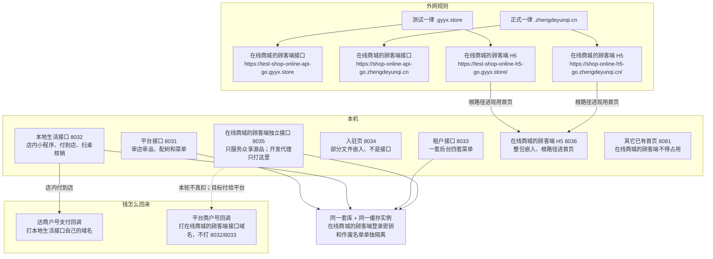

# 部署架构

这张图看进程怎么摆、测试和正式用哪套域名。在线商城顾客端只打在线商城的顾客端接口，不要指到本地生活或租户后台。这是白话图里**唯一写端口和域名**的一张。文字细则在《部署与环境》。

## 给谁看

开发联调、测试指环境、运维加反代。Jenkins / 面板由运维加，本图不代替运维清单。

## 关键规则

- 共库、短信、上传沿用，不等于可以混接接口。
- 在线商城的顾客端支付 / 退款回调打在线商城顾客端自己的域名。
- 本轮在线商城的顾客端不调起真扣款，图上用虚线留口。
- 在线商城的顾客端挂了，店内和租户后台仍应能跑。
- Redis 库号不画死。未合主分支不画成生产已上线。

## 图

开发时在线商城的顾客端工程只代理 `127.0.0.1:8035`。在线商城的顾客端 H5 测试 / 正式根路径进首页，不用入驻那种子路径。

## 不画什么

- K8s、监控产品、多活、灰度比例。
- 编造本地生活 / 平台 / 租户的具体主机名（除测试域 / 正式域总规则外未写死的不画）。
- 把在线商城的顾客端接到 8032 或 8033「方便联调」。
- 真扣款成功路径画成实线已上线。
